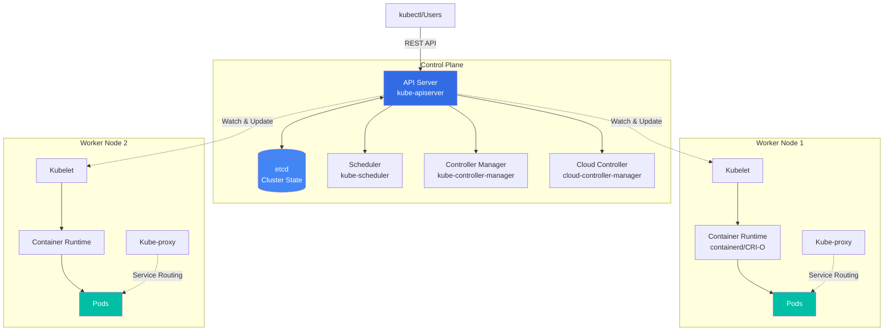

# 🚀 Kubernetes for Beginners

<div align="center">


**A comprehensive, hands-on learning repository for mastering Kubernetes from fundamentals to advanced production-ready concepts.**

[Getting Started](#-quick-start) • [Lab Manuals](#-lab-manuals) • [Documentation](#-documentation) • [Architecture](#-kubernetes-architecture) • [Contributing](#-contributing)

</div>

---

## 📖 Overview

Welcome to **Kubernetes for Beginners** — your practical guide to mastering container orchestration. This repository provides:

- **43 comprehensive lab manuals** with step-by-step instructions covering fundamentals to advanced topics
- **100+ hands-on YAML manifests** for all core Kubernetes concepts
- **Real-world examples** including multi-tier applications and production patterns
- **Modern Kubernetes features** including K8s 1.25-1.28+ (PSS/PSA, Gateway API, Native Sidecar, CEL Validation)
- **7 curated learning paths** for different goals and experience levels
- **CKA/CKAD/CKS certification alignment** with exam-focused content
- **Progressive learning approach** from basics to advanced topics with cross-referenced labs

> 💡 **Philosophy**: Learn by doing. Every concept comes with working examples you can deploy in your own cluster.

---

## 🎯 What You'll Learn

By working through this repository, you will:

✅ Understand Kubernetes **architecture and core components**
✅ Master **Pods, Deployments, Services, and Ingress**
✅ Configure **storage with Persistent Volumes and StatefulSets**
✅ Implement **security with RBAC, Network Policies, and Pod Security Standards (PSS/PSA)**
✅ Scale applications with **HPA and resource management**
✅ Debug and troubleshoot **production issues**
✅ Deploy **stateful applications** like databases
✅ Perform **cluster upgrades** with zero downtime
✅ Set up **high availability (HA) multi-master clusters**
✅ Extend Kubernetes with **Custom Resource Definitions (CRDs)**
✅ Prepare for **CKA/CKAD/CKS certifications**

---

## 🏗️ Kubernetes Architecture

Understanding the architecture is key to mastering Kubernetes. Here's how the components work together:



### Key Components

| Component | Role | Location |
|-----------|------|----------|
| **API Server** | Central management hub, handles all REST requests | Control Plane |
| **etcd** | Distributed key-value store for cluster state | Control Plane |
| **Scheduler** | Assigns pods to nodes based on resources | Control Plane |
| **Controller Manager** | Maintains desired state (ReplicaSet, Deployment controllers) | Control Plane |
| **Kubelet** | Ensures containers are running on the node | Worker Nodes |
| **Kube-proxy** | Manages network rules and load balancing | Worker Nodes |
| **Container Runtime** | Runs containers (containerd, CRI-O) | Worker Nodes |

For a deep dive into architecture, see our [Interactive Architecture Documentation](k8s/architecture/).

---

## 🖥️ Lab Setup Requirements

### Minimum Requirements

To follow along with the labs, you'll need a Kubernetes cluster with:

- **1 Control Plane node** (master)
- **2 Worker nodes** (for observing scheduling, DaemonSets, and affinity)
- **Kubernetes v1.24+** (examples tested through v1.32, with modern 1.25-1.28+ features)

### Recommended Setup Options

<table>
<tr>
<th>Tool</th>
<th>Best For</th>
<th>Setup Time</th>
<th>Resources</th>
</tr>
<tr>
<td><strong>kind</strong></td>
<td>Local development, CI/CD testing</td>
<td>⚡ 2 minutes</td>
<td>4GB RAM, 2 CPUs</td>
</tr>
<tr>
<td><strong>minikube</strong></td>
<td>Learning, single/multi-node clusters</td>
<td>⚡ 3 minutes</td>
<td>4GB RAM, 2 CPUs</td>
</tr>
<tr>
<td><strong>k3s</strong></td>
<td>Lightweight, IoT, edge computing</td>
<td>⚡ 1 minute</td>
<td>512MB RAM, 1 CPU</td>
</tr>
<tr>
<td><strong>Docker Desktop</strong></td>
<td>Mac/Windows users, single-node</td>
<td>⚡ 2 minutes</td>
<td>4GB RAM, 2 CPUs</td>
</tr>
<tr>
<td><strong>Cloud (EKS/GKE/AKS)</strong></td>
<td>Production-like environment</td>
<td>⏱️ 10-15 minutes</td>
<td>Varies</td>
</tr>
</table>

**Quick Start with kind:**
```bash
kind create cluster --config=- <<EOF
kind: Cluster
apiVersion: kind.x-k8s.io/v1alpha4
nodes:
- role: control-plane
- role: worker
- role: worker
EOF
```

---

## 📚 Lab Manuals

This repository includes **43 comprehensive lab manuals** organized into 9 logical categories:

### 🔰 Foundation (8 labs)
Learn the basics of Kubernetes, including cluster setup, core objects, and essential commands.

- [Lab 01: Creating Pods and Deployments](k8s/docs/labmanuals/lab01-creating-pods.md)
- [Lab 02: Creating Services](k8s/docs/labmanuals/lab02-creating-services.md)
- [Lab 03: ETCD Backup and Restore](k8s/docs/labmanuals/lab03-etcd-backup-restore.md)
- [Lab 04: Essential kubectl Commands](k8s/docs/labmanuals/lab04-kubectl-essentials.md)
- [Lab 05: Cluster Administration](k8s/docs/labmanuals/lab05-cluster-administration.md)
- [Lab 06: Kubernetes Installation](k8s/docs/labmanuals/lab06-kubernetes-installation.md)
- [Lab 07: RBAC Security](k8s/docs/labmanuals/lab07-rbac-security.md)
- [Lab 08: Docker Build and Run](k8s/docs/labmanuals/lab08-docker-build-run.md)

### 🔒 Security (5 labs)
Implement security best practices, from Pod security contexts to admission control.

- [Lab 09: Pod Security Context](k8s/docs/labmanuals/lab09-security-context.md)
- [Lab 10: Advanced Network Policies](k8s/docs/labmanuals/lab10-advanced-network-policies.md)
- [Lab 11: OPA Gatekeeper & CEL Validation](k8s/docs/labmanuals/lab11-opa-gatekeeper.md) ⭐ *Enhanced with K8s 1.25+*
- [Lab 12: Image Scanning with Trivy](k8s/docs/labmanuals/lab12-image-scanning.md)
- [Lab 38: Pod Security Standards & Admission](k8s/docs/labmanuals/lab38-pod-security-standards.md) 🆕 *K8s 1.25+*

### 💾 Storage (2 labs)
Master persistent storage, volumes, and stateful workloads.

- [Lab 13: Basic Storage Volumes](k8s/docs/labmanuals/lab13-basic-storage-volumes.md)
- [Lab 14: Persistent Storage](k8s/docs/labmanuals/lab14-persistent-storage.md)

### ⚙️ Workloads (9 labs)
Learn all workload controllers and patterns for running applications.

- [Lab 15: ConfigMaps](k8s/docs/labmanuals/lab15-configmap.md)
- [Lab 16: Deployment Strategies](k8s/docs/labmanuals/lab16-deployment-strategies.md)
- [Lab 17: DaemonSets](k8s/docs/labmanuals/lab17-daemonset.md)
- [Lab 18: Jobs and Batch Processing](k8s/docs/labmanuals/lab18-jobs-batch.md)
- [Lab 19: CronJobs & Timezone Support](k8s/docs/labmanuals/lab19-cronjob.md) ⭐ *Enhanced with K8s 1.25+*
- [Lab 20: Horizontal Pod Autoscaler](k8s/docs/labmanuals/lab20-hpa.md)
- [Lab 21: Init Containers](k8s/docs/labmanuals/lab21-init-containers.md)
- [Lab 22: Pod Lifecycle & Native Sidecar](k8s/docs/labmanuals/lab22-pod-lifecycle-multi-container.md) ⭐ *Enhanced with K8s 1.28+*
- [Lab 39: StatefulSets & Stateful Applications](k8s/docs/labmanuals/lab39-statefulsets.md) 🆕

### 🌐 Networking (4 labs)
Configure networking, services, DNS, and next-generation routing.

- [Lab 23: Multi-Port Services](k8s/docs/labmanuals/lab23-multi-port-services.md)
- [Lab 24: Ingress and EndpointSlices](k8s/docs/labmanuals/lab24-ingress-endpointslices.md)
- [Lab 25: DNS Configuration](k8s/docs/labmanuals/lab25-dns-configuration.md)
- [Lab 41: Gateway API with Domain Workarounds](k8s/docs/labmanuals/lab41-gateway-api.md) 🆕 *K8s 1.26+*

### 📅 Scheduling (4 labs)
Control Pod placement with advanced scheduling techniques.

- [Lab 26: NodeSelector Scheduling](k8s/docs/labmanuals/lab26-scheduling-nodeselector.md)
- [Lab 27: Affinity and Anti-Affinity](k8s/docs/labmanuals/lab27-scheduling-affinity.md)
- [Lab 28: Priority Classes](k8s/docs/labmanuals/lab28-scheduling-priorityclass.md)
- [Lab 29: Taints and Tolerations](k8s/docs/labmanuals/lab29-scheduling-tolerations.md)

### 👁️ Observability (2 labs)
Monitor application health and cluster metrics.

- [Lab 30: Health Probes](k8s/docs/labmanuals/lab30-probes.md)
- [Lab 31: Metrics Server](k8s/docs/labmanuals/lab31-metrics-server.md)

### 📊 Resource Management (3 labs)
Manage resources, quotas, and deployment rollouts.

- [Lab 32: Resource Quotas and Limits](k8s/docs/labmanuals/lab32-resource-quotas-limits.md)
- [Lab 33: Deployment Rollouts](k8s/docs/labmanuals/lab33-deployment-rollouts.md)
- [Lab 34: Kubernetes Dashboard](k8s/docs/labmanuals/lab34-kubernetes-dashboard.md)

### 🚀 Advanced Topics (6 labs)
Explore advanced patterns, cluster operations, and API extensions.

- [Lab 35: Static Pods](k8s/docs/labmanuals/lab35-static-pods.md)
- [Lab 36: WordPress on Kubernetes](k8s/docs/labmanuals/lab36-wordpress-on-k8s.md)
- [Lab 37: Frontend Deployment](k8s/docs/labmanuals/lab37-frontend-deployment.md)
- [Lab 40: Cluster Upgrades with kubeadm](k8s/docs/labmanuals/lab40-cluster-upgrades.md) 🆕
- [Lab 42: High Availability Cluster (Optional)](k8s/docs/labmanuals/lab42-ha-cluster-optional.md) 🆕
- [Lab 43: Custom Resource Definitions (Optional)](k8s/docs/labmanuals/lab43-custom-resource-definitions.md) 🆕

📖 **Complete Lab Index**: See [Lab Manuals README](k8s/docs/labmanuals/README.md) for full details, learning paths, and prerequisites.

---

## 🗂️ Repository Structure

```
k8sforbeginners/
├── k8s/
│   ├── architecture/          # Interactive architecture diagrams
│   ├── docs/
│   │   ├── labmanuals/        # 43 comprehensive lab manuals 📚
│   │   ├── kubectl-reference.md  # kubectl command cheat sheet
│   │   ├── basics/            # Kubernetes fundamentals documentation
│   │   ├── storage/           # Storage concepts and guides
│   │   ├── networking/        # Networking deep dives
│   │   ├── security/          # Security best practices
│   │   ├── scheduling/        # Pod scheduling documentation
│   │   ├── workloads/         # Workload patterns and observability
│   │   ├── troubleshooting/   # Debugging guides
│   │   └── upgrade/           # Cluster upgrade guides
│   └── labs/
│       ├── basics/            # Basic Kubernetes objects (Pods, Services)
│       ├── workloads/         # Deployments, StatefulSets, Jobs, etc.
│       ├── networking/        # Services, Ingress, Gateway API
│       ├── storage/           # Volumes, PV/PVC examples
│       ├── config/            # ConfigMaps and Secrets
│       ├── security/          # RBAC, NetworkPolicy, PSS/PSA
│       ├── scheduling/        # NodeSelector, Affinity, Taints
│       ├── administration/    # Cluster admin tasks
│       └── advanced/          # CRDs, custom resources
└── README.md                  # This file
```

---

## 📘 How to Use This Repo

### Quick Start

1. **Clone the repository**
   ```bash
   git clone https://github.com/devopscert202/k8sforbeginners.git
   cd k8sforbeginners
   ```

2. **Set up your Kubernetes cluster** (see [Lab Setup Requirements](#️-lab-setup-requirements))

3. **Start with the lab manuals**
   - Navigate to [Lab Manuals README](k8s/docs/labmanuals/README.md)
   - Choose a learning path or start with Lab 01
   - Follow the step-by-step instructions

4. **Apply manifests from labs directory**
   ```bash
   kubectl apply -f k8s/labs/basics/apache1.yaml
   ```

5. **Observe and experiment**
   ```bash
   kubectl get pods
   kubectl describe pod <pod-name>
   kubectl logs <pod-name>
   ```

6. **Modify and re-apply** to deepen understanding

---

## 🧪 Learning Paths

Choose a learning path based on your goals:

### Path 1: Complete Beginner
Start from zero Kubernetes knowledge:
```
Lab 08 (Docker) → Lab 01 (Pods) → Lab 02 (Services) → Lab 04 (kubectl) →
Lab 15 (ConfigMaps) → Lab 16 (Deployments)
```

### Path 2: Security Focus
Master Kubernetes security:
```
Lab 01 (basics) → Lab 07 (RBAC) → Lab 09 (Security Context) →
Lab 10 (Network Policies) → Lab 11 (OPA) → Lab 12 (Image Scanning) → Lab 38 (PSS/PSA)
```

### Path 3: Production Readiness
Build production-grade deployments:
```
Labs 01-08 (Foundation) → Lab 30 (Probes) → Lab 31 (Metrics) →
Lab 20 (HPA) → Lab 32 (Quotas) → Lab 33 (Rollouts) → Lab 40 (Upgrades)
```

### Path 4: CKA Exam Preparation
Focus on CKA certification topics:
```
Follow the Foundation labs → Security → Storage → Scheduling →
Observability → Resource Management → Lab 40 (Cluster Upgrades)
```

See [Lab Manuals README](k8s/docs/labmanuals/README.md) for all 7 learning paths.

---

## 🆕 Modern Kubernetes Features (K8s 1.25-1.28+)

This repository includes hands-on labs for the latest Kubernetes features:

| Feature | Lab | K8s Version | Description |
|---------|-----|-------------|-------------|
| **Pod Security Standards (PSS)** | Lab 38 | 1.25+ | Privileged, Baseline, Restricted profiles |
| **Pod Security Admission (PSA)** | Lab 38 | 1.25+ | Enforce, audit, warn modes |
| **CronJob Timezone Support** | Lab 19 | 1.25+ | `.spec.timeZone` field with IANA timezones |
| **Native CEL Validation** | Lab 11 | 1.25+ | ValidatingAdmissionPolicy with CEL |
| **Gateway API** | Lab 41 | 1.26+ | Next-generation Ingress with advanced routing |
| **Native Sidecar Containers** | Lab 22 | 1.28+ | `restartPolicy: Always` for init containers |

---

## 📖 Documentation

In addition to lab manuals, this repository includes comprehensive documentation:

### Quick References
- **[kubectl Command Reference](k8s/docs/kubectl-reference.md)** - Complete kubectl cheat sheet 🆕
- **[Kubernetes Objects Guide](k8s/docs/basics/k8s-objects-complete.md)** - All K8s objects from basics to advanced

### Conceptual Guides
- **[Observability Basics](k8s/docs/workloads/observability-basics.md)** - Metrics, Logs, Traces 🆕
- **[Storage Complete Guide](k8s/docs/storage/k8s-storage-complete.md)** - Volumes, PV/PVC, StorageClass
- **[Scheduling Concepts](k8s/docs/scheduling/scheduling-concepts.md)** - Pod scheduling deep dive
- **[Network Policies](k8s/docs/security/networkpolicy.md)** - Network security patterns

### Upgrade Guides
- **[Kubernetes v1.31 to v1.32 Upgrade](k8s/docs/upgrade/v1.31_to_v1.32.md)** - Version-specific upgrade guide 🆕

---

## 🤝 Contributing

Contributions are welcome! Here's how you can help:

### Reporting Issues
Found a bug or typo? [Open an issue](https://github.com/devopscert202/k8sforbeginners/issues) with:
- Lab number and section
- Description of the issue
- Expected vs actual behavior
- Your environment (K8s version, cluster type)

### Suggesting Improvements
Have ideas for new labs or improvements? Open an issue with:
- Clear description of the suggestion
- Examples and use cases
- How it would benefit learners

### Submitting Pull Requests
To contribute directly:
1. Fork the repository
2. Create a feature branch: `git checkout -b feature/new-lab`
3. Make your changes with clear commits
4. Test thoroughly
5. Submit a Pull Request with:
   - Clear title describing the change
   - Detailed description of what and why
   - Reference any related issues
   - Screenshots or outputs if applicable

**PR Guidelines**:
- Keep changes focused and atomic
- Follow existing lab manual formatting
- Ensure all commands are tested
- Use consistent terminology
- Update the lab index if adding/removing labs

See [Contributing Guidelines](k8s/docs/labmanuals/README.md#contributing--reporting-issues) for more details.

---

## 📊 Repository Statistics

- **43 comprehensive lab manuals** with step-by-step instructions
- **100+ YAML manifests** covering all Kubernetes concepts
- **9 logical categories** (Foundation, Security, Storage, Workloads, etc.)
- **7 curated learning paths** for different goals
- **Modern K8s features** (1.25-1.28+)
- **CKA/CKAD/CKS alignment** for certification preparation
- **~45,000 lines** of educational content
- **Kubernetes v1.24-1.32** compatibility

---

## 📜 License

This project is licensed under the MIT License - see the LICENSE file for details.

---

## ✨ Acknowledgments

- Kubernetes Official Documentation
- CNCF Kubernetes Training
- Real-world production patterns and best practices
- Community contributions and feedback

---

## 🎯 Getting Started Checklist

- [ ] Set up a Kubernetes cluster (kind, minikube, or cloud)
- [ ] Install kubectl CLI tool
- [ ] Clone this repository
- [ ] Review [Lab Manuals README](k8s/docs/labmanuals/README.md)
- [ ] Choose a learning path
- [ ] Start with Lab 01 or your chosen starting point
- [ ] Join the Kubernetes community ([Slack](https://slack.k8s.io/), [Forums](https://discuss.kubernetes.io/))

---

<div align="center">

**Happy Learning! 🚀**

*Master Kubernetes one lab at a time.*

⭐ **Star this repo** if you find it helpful!

📖 Start your journey: [Lab 01 - Creating Pods](k8s/docs/labmanuals/lab01-creating-pods.md)

</div>

---

*Last Updated: March 16, 2026*
*Total Labs: 43*
*Kubernetes Compatibility: v1.24 through v1.32*
