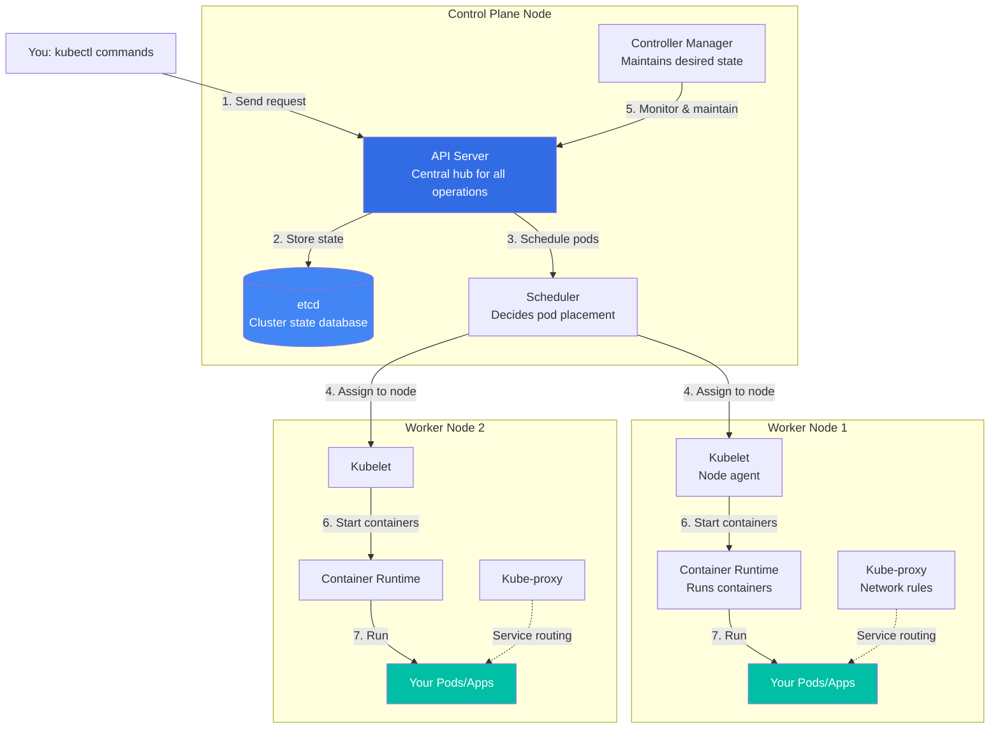

# Kubernetes for Beginners

<div align="center">


**Learn Kubernetes through hands-on practice with 48 comprehensive lab manuals**

</div>

---

## 🎯 What is This Repository?

This is a **complete, hands-on learning resource** for mastering Kubernetes from absolute basics to production-ready advanced concepts. Whether you're preparing for CKA/CKAD certification or building production skills, this repository provides:

- **48 step-by-step lab manuals** covering every major Kubernetes topic
- **100+ working YAML examples** ready to deploy
- **Real-world patterns** used in production environments
- **Modern features** including Kubernetes 1.25-1.28+ capabilities

> 💡 **Learning Philosophy**: No theory without practice. Every concept comes with hands-on exercises you can run in your own cluster.

---

## 📖 Quick Start

### Prerequisites

You'll need a Kubernetes cluster to follow along.

**Minimum Lab Environment**:
- **3 Linux VMs** (1 control plane + 2 worker nodes)
- **Ubuntu 20.04/22.04** or similar Linux distribution
- **2 CPU, 4GB RAM** per VM minimum (4 CPU, 8GB RAM recommended)
- **Kubernetes 1.24+** installed via kubeadm

> ⚠️ **Important Disclaimer**: This repository is designed for **standalone Kubernetes clusters** built with kubeadm in lab/development environments. These are NOT for managed services (EKS, GKE, AKS) or local dev tools (kind, minikube). All examples assume you have direct control plane access and a true multi-node setup for observing scheduling, DaemonSets, affinity, taints/tolerations, and other distributed concepts that require multiple worker nodes.

### Getting Started

```bash
# 1. Clone this repository
git clone https://github.com/devopscert202/k8sforbeginners.git
cd k8sforbeginners

# 2. Start with Lab 01
cd k8s/labmanuals
cat lab01-basics-creating-pods.md

# 3. Follow the exercises and apply manifests
kubectl apply -f ../../labs/basics/apache1.yaml

# 4. Learn, experiment, break things, fix them, repeat!
```

---

## 🏗️ Understanding Kubernetes Architecture

Before diving into labs, let's understand how Kubernetes works.

### The Big Picture

Kubernetes follows a **control plane + worker nodes** architecture. The control plane makes decisions about the cluster (scheduling, scaling, updates), while worker nodes run your actual applications.



### Component Roles Explained

**Control Plane Components** (Decision makers):

| Component | What It Does | Why It Matters |
|-----------|--------------|----------------|
| **API Server** | Front door to Kubernetes - all requests go here | Every kubectl command hits this |
| **etcd** | Key-value database storing cluster state | The "source of truth" for everything |
| **Scheduler** | Picks which node should run each pod | Ensures optimal resource usage |
| **Controller Manager** | Keeps actual state = desired state | Auto-heals, scales, and updates |

**Worker Node Components** (Do the actual work):

| Component | What It Does | Why It Matters |
|-----------|--------------|----------------|
| **Kubelet** | Agent that talks to control plane | Ensures containers are running |
| **Kube-proxy** | Manages networking rules | Enables service discovery and load balancing |
| **Container Runtime** | Actually runs containers (containerd, CRI-O) | Where your code executes |

**How It All Works Together**:
1. You run `kubectl create deployment nginx --image=nginx`
2. API Server receives the request
3. Scheduler picks a node with available resources
4. Kubelet on that node pulls the image and starts the container
5. Controllers monitor and maintain the deployment
6. Kube-proxy sets up networking so you can reach your app

> 📚 **Learn More**: See our [Interactive Architecture Documentation](k8s/architecture/) for visual deep-dives.

---

## 📚 What's Inside This Repository

### 1. 📖 Lab Manuals (Your Primary Learning Resource)

**Location**: `k8s/labmanuals/`

**48 comprehensive lab manuals** organized into 10 categories:

| Category | Labs | What You'll Learn |
|----------|------|-------------------|
| **🔰 Foundation** | 8 labs | Cluster setup, Pods, Services, kubectl, RBAC, Docker basics |
| **🔒 Security** | 5 labs | Security contexts, Network Policies, OPA, Image scanning, Pod Security Standards |
| **💾 Storage** | 2 labs | Volumes, Persistent Volumes, PVCs, NFS, StatefulSets |
| **⚙️ Workloads** | 10 labs | Deployments, DaemonSets, Jobs, CronJobs, HPA, Init containers, Multi-container patterns, Secrets |
| **🌐 Networking** | 4 labs | Services, Ingress, DNS, Gateway API |
| **📅 Scheduling** | 4 labs | NodeSelector, Affinity, Priority, Taints & Tolerations |
| **👁️ Observability** | 2 labs | Health probes, Metrics Server |
| **📊 Resource Mgmt** | 3 labs | Quotas, Limits, Deployment rollouts, Dashboard |
| **🚀 Advanced** | 6 labs | Static Pods, Real apps (WordPress), Cluster upgrades, HA setup, CRDs |
| **🛠️ Tools** | 1 lab | Helm Charts — install, upgrade, rollback, create charts |

**Each lab includes**:
- Clear learning objectives
- Prerequisites and setup
- Step-by-step exercises with commands
- Expected outputs
- Troubleshooting section
- Key takeaways
- Links to related labs

**Start here**: [Lab Manuals Index](k8s/labmanuals/README.md) - includes learning paths for different goals.

**YAML focus:** [Lab 46: YAML Manifests Deep Dive](k8s/labmanuals/lab46-basics-yaml-manifests.md) and [YAML 101](k8s/docs/basics/yaml-basics.md).

---

### 2. 🗂️ YAML Manifests (Ready-to-Use Examples)

**Location**: `k8s/labs/`

Over **100 working YAML files** organized by category:

```
k8s/labs/
├── basics/              # Pods, Namespaces, Services (Lab 01-02)
├── yaml-lab/            # Lab 46 — YAML manifests practice
├── workloads/          # Deployments, Jobs, CronJobs, StatefulSets (Lab 15-22, 39)
├── networking/         # Services, Ingress, Gateway API (Lab 23-25, 41)
├── storage/            # Volumes, PV/PVC, StorageClass (Lab 13-14)
├── config/             # ConfigMaps, Secrets (Lab 15)
├── security/           # RBAC, NetworkPolicy, PSS (Lab 07, 09-12, 38)
├── scheduling/         # NodeSelector, Affinity, Taints (Lab 26-29)
├── administration/     # Cluster admin tasks (Lab 03-06)
└── advanced/           # CRDs, custom resources (Lab 43)
```

**All manifests are**:
- ✅ Tested and working
- ✅ Commented with explanations
- ✅ Following best practices
- ✅ Ready to apply: `kubectl apply -f <file>`

---

### 3. 📘 Reference Documentation (Deep Dives & Guides)

**Location**: `k8s/docs/`

**Comprehensive guides** that complement the labs:

#### Quick References
- **[kubectl Command Reference](k8s/docs/kubectl-reference.md)** - Complete cheat sheet for kubectl
- **[YAML 101 for Kubernetes Labs](k8s/docs/basics/yaml-basics.md)** - Markdown primer; hands-on [Lab 46](k8s/labmanuals/lab46-basics-yaml-manifests.md); interactive HTML: [Part 1](k8s/html/yaml-k8s-part1-syntax.html), [Part 2](k8s/html/yaml-k8s-part2-objects-editing.html), [Part 3](k8s/html/yaml-k8s-part3-tools-troubleshooting.html); [all HTML guides](k8s/html/index.html)
- **[Kubernetes Objects Guide](k8s/docs/basics/k8s-objects-complete.md)** - All K8s objects explained (basics → advanced)

#### Conceptual Deep Dives
- **[Observability Basics](k8s/docs/workloads/observability-basics.md)** - Metrics, Logs, Traces with Prometheus/Grafana
- **[Storage Guide](k8s/docs/storage/k8s-storage-complete.md)** - Volumes, PV/PVC, StorageClass deep-dive
- **[Scheduling Concepts](k8s/docs/scheduling/scheduling-concepts.md)** - How the K8s scheduler works
- **[Network Policies](k8s/docs/security/networkpolicy.md)** - Securing pod communication

#### Operations Guides
- **[Cluster Upgrade Guide](k8s/docs/upgrade/v1.31_to_v1.32.md)** - Version-specific upgrade procedures
- **[Troubleshooting](k8s/docs/troubleshooting/k8s-issues.md)** - Common issues and solutions

---

## 🎓 Learning Paths

Choose your path based on your goal:

### Path 1: Complete Beginner (Start Here)
New to Kubernetes? Start with these:
```
YAML 101 (read yaml-basics.md or HTML Parts 1–3) → Lab 46 (YAML manifests hands-on) →
Lab 08 (Docker Basics) → Lab 01 (Pods) → Lab 02 (Services) →
Lab 04 (kubectl) → Lab 15 (ConfigMaps) → Lab 16 (Deployments)
```

### Path 2: CKA Certification Prep
Focus on exam topics:
```
Foundation (Lab 01-08) → Storage (Lab 13-14) → Security (Lab 07, 09-10) →
Scheduling (Lab 26-29) → Observability (Lab 30-31) → Cluster Ops (Lab 03, 05, 40)
```

### Path 3: Security Specialist
Deep dive into K8s security:
```
Lab 01 (basics) → Lab 07 (RBAC) → Lab 09 (Security Context) →
Lab 10 (Network Policies) → Lab 11 (OPA) → Lab 12 (Image Scanning) →
Lab 38 (Pod Security Standards)
```

### Path 4: Production Readiness
Build production-grade skills:
```
Foundation (Lab 01-08) → Lab 30 (Probes) → Lab 31 (Metrics) →
Lab 20 (HPA) → Lab 32 (Quotas) → Lab 39 (StatefulSets) →
Lab 40 (Upgrades) → Lab 42 (HA Cluster)
```

📖 **See all 7 learning paths**: [Lab Manuals README](k8s/labmanuals/README.md)

---

## 🆕 Modern Kubernetes Features (v1.25-1.28+)

This repository includes hands-on labs for cutting-edge features:

| Feature | Lab | K8s Version | What It Enables |
|---------|-----|-------------|-----------------|
| **Pod Security Standards** | Lab 38 | 1.25+ | Replace deprecated PodSecurityPolicy with Privileged/Baseline/Restricted profiles |
| **CronJob Timezones** | Lab 19 | 1.25+ | Run scheduled jobs in specific timezones (not just UTC) |
| **Native CEL Validation** | Lab 11 | 1.25+ | Validate resources using Common Expression Language |
| **Gateway API** | Lab 41 | 1.26+ | Next-generation Ingress with advanced routing capabilities |
| **Native Sidecar Containers** | Lab 22 | 1.28+ | Declare sidecars explicitly with `restartPolicy: Always` |

---

## 🛠️ How to Use This Repository

### Step 1: Set Up Your Lab Environment

You need a **3-node Kubernetes cluster** (1 control plane + 2 workers).

**Setup with kubeadm**:
- Provision 3 Linux VMs (Ubuntu 20.04/22.04)
- Install Kubernetes using kubeadm
- Gives you full control plane access
- Best for understanding K8s internals and CKA preparation
- **Follow**: [Lab 06: Kubernetes Installation](k8s/labmanuals/lab06-install-kubernetes-kubeadm.md)

**Why kubeadm?**
- ✅ Learn cluster internals (etcd, certificates, control plane components)
- ✅ Practice CKA-style cluster operations
- ✅ True multi-node behavior (scheduling, DaemonSets, taints/tolerations)
- ✅ Full control over cluster configuration

### Step 2: Choose Your Learning Path

Pick based on your goal:
- **New to K8s?** → Start with Path 1 (Complete Beginner)
- **CKA Exam?** → Follow Path 2 (CKA Certification)
- **Production Focus?** → Choose Path 4 (Production Readiness)

See [Learning Paths](#-learning-paths) above.

### Step 3: Work Through Labs

1. Open a lab manual: `k8s/labmanuals/lab01-basics-creating-pods.md`
2. Read the overview and learning objectives
3. Follow the exercises step-by-step
4. Apply the YAML manifests: `kubectl apply -f k8s/labs/basics/apache1.yaml`
5. Observe the results: `kubectl get pods`, `kubectl describe pod <name>`
6. Experiment: Modify YAMLs, break things, fix them
7. Complete cleanup before moving to next lab

### Step 4: Reference Documentation as Needed

When you need deeper understanding:
- **YAML syntax or manifest structure?** → Read [yaml-basics.md](k8s/docs/basics/yaml-basics.md), run [Lab 46](k8s/labmanuals/lab46-basics-yaml-manifests.md), or open the [HTML YAML series](k8s/html/yaml-k8s-part1-syntax.html)
- **kubectl commands?** → Check [kubectl-reference.md](k8s/docs/kubectl-reference.md)
- **How storage works?** → Read [k8s-storage-complete.md](k8s/docs/storage/k8s-storage-complete.md)
- **Observability concepts?** → See [observability-basics.md](k8s/docs/workloads/observability-basics.md)

---

## 🤝 Contributing & Reporting Issues

We welcome contributions! Here's how you can help improve this learning resource.

### 🐛 Found a Bug or Issue?

If you encounter:
- ❌ Commands that don't work
- ❌ Typos or unclear instructions
- ❌ Incorrect YAML syntax
- ❌ Broken links between labs

**Report it**:
1. Check if [issue already exists](https://github.com/devopscert202/k8sforbeginners/issues)
2. If not, [create a new issue](https://github.com/devopscert202/k8sforbeginners/issues/new) with:
   - Lab number and section
   - What's wrong (expected vs actual)
   - Your environment (K8s version, OS)
   - Steps to reproduce

### 💡 Have a Suggestion?

Want to:
- ✨ Suggest a new lab topic
- ✨ Improve existing documentation
- ✨ Add more examples
- ✨ Fix unclear explanations

**Suggest it**:
1. [Open an issue](https://github.com/devopscert202/k8sforbeginners/issues/new) describing:
   - What you want to add/improve
   - Why it would help learners
   - Example of what you have in mind

### 🔧 Want to Contribute Code/Documentation?

**Submit a Pull Request**:

1. **Fork the repository** to your GitHub account
   ```bash
   # Click "Fork" button on GitHub
   ```

2. **Clone your fork**
   ```bash
   git clone https://github.com/YOUR-USERNAME/k8sforbeginners.git
   cd k8sforbeginners
   ```

3. **Create a feature branch**
   ```bash
   git checkout -b fix/lab05-typo
   # or
   git checkout -b feature/add-service-mesh-lab
   ```

4. **Make your changes**
   - Fix the issue or add your improvement
   - Test all commands in a real cluster
   - Follow existing lab manual formatting
   - Use consistent terminology with official K8s docs

5. **Commit with clear messages**
   ```bash
   git add .
   git commit -m "fix: correct kubectl command in Lab 05 Exercise 3"
   # or
   git commit -m "docs: add troubleshooting section to Lab 10"
   ```

6. **Push to your fork**
   ```bash
   git push origin fix/lab05-typo
   ```

7. **Create Pull Request**
   - Go to your fork on GitHub
   - Click "Pull Request" button
   - Fill in the PR template with:
     - **Title**: Clear description (e.g., "Fix kubectl command in Lab 05")
     - **Description**: What changed and why
     - **Testing**: How you tested it
     - **Related Issue**: Link any related issues

**PR Guidelines**:
- ✅ One fix/feature per PR (keep changes focused)
- ✅ Test all commands before submitting
- ✅ Follow existing formatting style
- ✅ Update related documentation if needed
- ✅ Keep descriptions clear and detailed

**Example Good PR**:
```
Title: Fix incorrect namespace flag in Lab 10 NetworkPolicy example

Description:
- Changed `-n default` to `-n production` in Exercise 3
- The namespace name didn't match the YAML manifest
- Tested on K8s 1.28 cluster

Related Issue: #42
```

### 📝 Code of Conduct

- Be respectful and constructive
- Help others learn
- No spam or self-promotion
- Focus on improving the learning experience

---

## ⚠️ Important Notes

### Environment Disclaimer

This repository is designed for **standalone Kubernetes clusters** built with kubeadm in lab/development environments:

- ✅ Perfect for: kubeadm clusters on local VMs or bare metal
- ✅ Requires: 3 Linux VMs (1 control plane + 2 workers minimum)
- ✅ OS: Ubuntu 20.04/22.04 or similar distributions
- ⚠️ Not for: Managed services (EKS, GKE, AKS) or local dev tools (kind, minikube)
- ⚠️ Not for: Production environments (this is a learning resource)

Many exercises require:
- Direct control plane access (for etcd backup, cluster upgrades)
- Multi-node setup (for DaemonSets, affinity, taints/tolerations)
- Unrestricted pod security (some exercises demonstrate unsafe configurations for learning)

### Version Compatibility

- Labs tested on **Kubernetes 1.24 through 1.32**
- Some modern features require **K8s 1.25+** (clearly marked)
- Use matching `kubectl` version with your cluster

### Learning Approach

This is a **hands-on learning resource**, not a copy-paste tutorial:
- 🔬 Experiment with the examples
- 💥 Break things intentionally to learn
- 🔍 Read error messages carefully
- 🛠️ Fix issues yourself before checking solutions
- 📝 Take notes on what you learn

---

## 📊 Repository Statistics

- **48** comprehensive lab manuals with step-by-step instructions
- **100+** working YAML manifests covering all K8s concepts
- **10** logical categories from basics to advanced
- **7** curated learning paths for different goals
- **~47,500** lines of educational content
- **v1.24-1.32** Kubernetes compatibility
- **Modern features**: PSS/PSA, Gateway API, Native Sidecars, CEL Validation

---

## 📜 License

This project is licensed under the MIT License - see the [LICENSE](LICENSE) file for details.

---

## 🙏 Acknowledgments

- **Kubernetes Official Documentation** - Foundation of all concepts
- **CNCF** - For maintaining Kubernetes and the ecosystem
- **Community Contributors** - For feedback and improvements
- **Real-world Production Experience** - For practical patterns and best practices

---

## 📞 Get Help

- 💬 **Questions?** - [Open a discussion](https://github.com/devopscert202/k8sforbeginners/discussions)
- 🐛 **Issues?** - [Report a bug](https://github.com/devopscert202/k8sforbeginners/issues)
- 💡 **Ideas?** - [Suggest improvements](https://github.com/devopscert202/k8sforbeginners/issues)
- 📖 **K8s Docs** - [Official Kubernetes Documentation](https://kubernetes.io/docs/)
- 🎓 **Slack** - [Kubernetes Community Slack](https://slack.k8s.io/)

---

<div align="center">

## 🚀 Ready to Start?

**Begin your Kubernetes journey with Lab 01**

[📖 Go to Lab Manuals →](k8s/labmanuals/README.md)

---

⭐ **Star this repo** if you find it helpful!

🍴 **Fork it** to customize for your learning

🤝 **Contribute** to help others learn

---

*Master Kubernetes one lab at a time* 🎯

**Last Updated**: March 2026 | **Total Labs**: 48 | **K8s Versions**: v1.24-1.32

</div>
