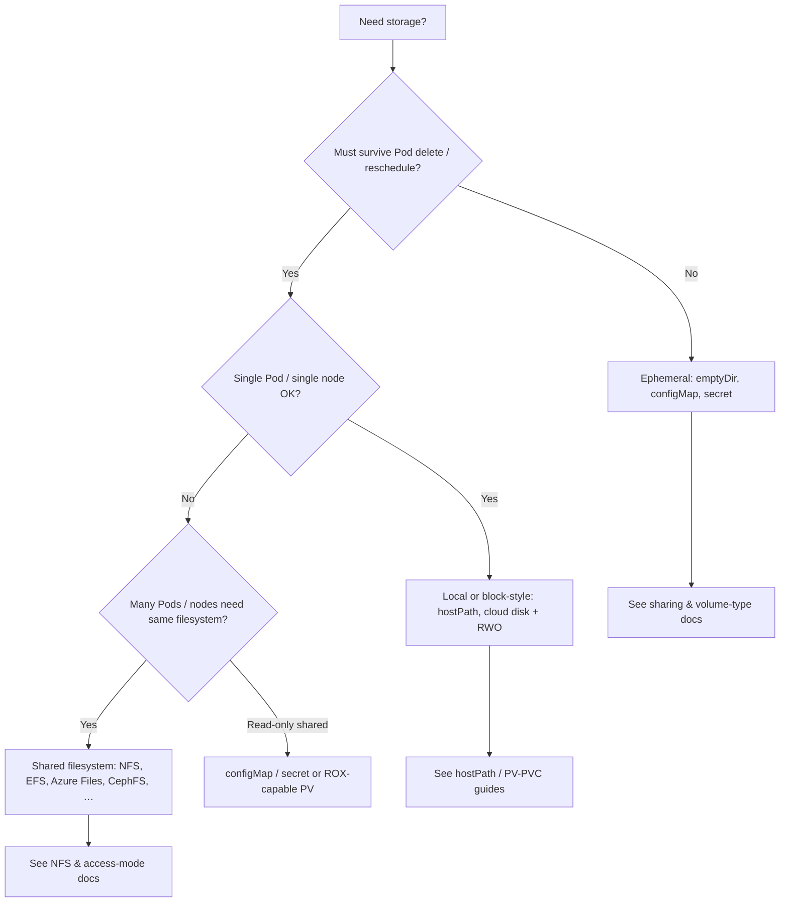

# Kubernetes Storage: Concepts Overview

This page is the **storage landing page** for this folder. It explains how pieces fit together and points to focused guides for hostPath, NFS, access modes, ConfigMaps, Secrets, and multi-container patterns.

---

## How Kubernetes storage fits together

Kubernetes separates **where data lives** from **how Pods use it**. **Ephemeral** storage (for example `emptyDir`) exists for the life of the Pod and is recreated when the Pod is rescheduled. **Persistent** storage survives Pod restarts and is modeled with **PersistentVolumes (PVs)** and **PersistentVolumeClaims (PVCs)**: cluster admins (or automation) define capacity and backends as PVs; workloads request storage with PVCs, and the control plane binds matching pairs. **Inline volumes** in a Pod spec tie storage directly to that Pod; PV/PVC decouples provisioning from the workload so the same app YAML can run in different clusters. **Dynamic provisioning** creates PVs automatically when a PVC names a **StorageClass**, so users rarely hand-author PV manifests in cloud environments. Most modern backends integrate through the **Container Storage Interface (CSI)**: vendors ship drivers that implement attach, detach, mount, resize, and snapshots against their storage, and Kubernetes calls those drivers instead of hard-coding each provider.

---

## Choosing a storage pattern (decision flow)

Use this flow to narrow options before opening the topic-specific guides.

**Rules of thumb:** Prefer **PVC + StorageClass** over `hostPath` in production. Use **RWX**-capable backends only when multiple nodes must write the same files. Treat **Secrets** and **ConfigMaps** as small, API-managed content—not generic databases.

---

## Suggested learning path

Read top to bottom for breadth, or jump to the guide that matches your task.

### 1. Volumes inside the Pod (`emptyDir`, `hostPath`)

**`emptyDir`** is created when the Pod starts and removed when the Pod ends; it is ideal for scratch space and caches between containers in the same Pod. **`hostPath`** mounts a path on the **worker node** into the Pod—simple for labs and node-local data, but fragile when Pods move. For hostPath with PV/PVC patterns and cautions, see [hostPath PV/PVC](./hostpath-pv-pvc.md). Multi-container patterns that use shared volumes are covered in [sharing data between containers](./sharingdata.md) and [read/write in a Pod](./readwrite-pod.md).

### 2. Injecting configuration and secrets as volumes

**ConfigMap** and **secret** volumes project keys and files into the container filesystem without baking them into the image. They are ephemeral in the sense that they track the API object lifecycle, not a separate disk. Details and examples: [ConfigMap volumes](./configmap-volume.md), [Secret volumes](./secret-volume.md).

### 3. PersistentVolumes, PersistentVolumeClaims, access modes, StorageClass

**PVs** represent storage in the cluster; **PVCs** are Pod-scoped requests for size, access mode, and optionally a StorageClass. **Access modes** (RWO, ROX, RWX) describe how many nodes may mount the volume and whether writes are allowed—your backend must actually support the mode you request. **StorageClasses** describe provisioners, default policies, and binding behavior (for example `WaitForFirstConsumer`). See [access modes & StorageClasses](./accessmode-storageclasses.md).

### 4. Network shared storage (NFS-style)

**NFS** (and similar network filesystems) is a common way to get **ReadWriteMany** across nodes for legacy apps and shared content. Provisioning, PV/PVC layout, and operational notes are in [NFS PV/PVC](./nfs-pv-pvc-complete.md).

### 5. Lifecycle, reclaim, and dynamic provisioning (summary)

Typical lifecycle: **provision** (static PV or dynamic from StorageClass) → **bind** PVC to PV → **mount** in Pod → **release** when PVC is deleted → **reclaim** per policy (**Retain**, **Delete**; legacy **Recycle** is deprecated). Dynamic provisioning removes the manual PV step: the PVC’s StorageClass triggers the provisioner (often CSI) to create backing storage. Deeper YAML and policy discussion lives in [access modes & StorageClasses](./accessmode-storageclasses.md) and [NFS PV/PVC](./nfs-pv-pvc-complete.md).

---

## Volume type comparison (quick reference)

| Kind | Scope | Typical use | Survives Pod? |
|------|--------|-------------|----------------|
| `emptyDir` | Pod | Scratch, cache, share between containers in Pod | No |
| `hostPath` | Node filesystem | Labs, node agents, special cases | Data on node; not portable |
| `configMap` / `secret` | API objects | Config files, certs, small data | While object exists |
| PV/PVC (block/file) | Cluster | Databases, durable app data | Yes (per reclaim policy) |
| NFS / cloud file (RWX) | Shared service | Shared read/write across nodes | Yes (backend dependent) |

---

## Snapshots, capacity, and limits (cluster-level topics)

**Volume snapshots** (CSI snapshot API: `VolumeSnapshot`, `VolumeSnapshotClass`, `VolumeSnapshotContent`) capture a point-in-time copy of a PVC for backup/restore; they require a CSI driver that implements snapshotting. **Storage capacity** reporting (`CSIStorageCapacity`) helps the scheduler place Pods that need PVCs only on nodes where the driver advertises enough free capacity. **Node volume attachment limits** vary by cloud and instance type; exceeding them leaves Pods stuck unschedulable or volumes unmounted. These are usually configured with your platform docs and CSI driver—not repeated here in YAML.

---

## Container Storage Interface (CSI)

**CSI** is the standard plugin model between Kubernetes and storage vendors. A **CSI driver** runs controller and node components that implement provisioning, publishing (attach/detach), mounting, and optional features (resize, snapshots, topology). In-tree cloud volume plugins are largely replaced by CSI; your cluster’s supported storage is the list of installed drivers. Choosing a driver is an infrastructure decision (SLA, IOPS, RWO vs RWX, encryption); workload authors still consume storage through PVCs and StorageClasses.

---

## Shared storage backends (beyond NFS)

Many teams use **managed file services** (for example Amazon EFS, Azure Files, Google Filestore) for RWX without operating NFS servers. **Distributed systems** (CephFS, GlusterFS, and others) offer scale-out filesystems but add operational depth. The same design questions apply: network latency, permissions, backups, and HA of the storage tier. For Kubernetes mechanics, start with [NFS PV/PVC](./nfs-pv-pvc-complete.md) and [access modes & StorageClasses](./accessmode-storageclasses.md); choose the backend with your platform team.

---

## Limitations and practices (short list)

- Network filesystems add latency versus local disk; don’t assume NFS performance matches SSD block volumes.
- **hostPath** exposes node paths and breaks portability—avoid for routine app data.
- Match **access mode** to the real backend capability; binding can succeed in corner cases while second-node mounts fail.
- Plan **backup and restore** at the storage or snapshot layer; etcd backup does not replace volume data protection.
- Use **encryption in transit/at rest** and **RBAC** on Secrets and shared volumes per your security model.

---

## Hands-On Labs

| Lab | Description |
|-----|-------------|
| [Lab 38: Basic Storage Volumes in Kubernetes](../../labmanuals/lab38-storage-basic-volumes.md) | Core volume types and data sharing in Pods |
| [Lab 39: Persistent Volumes and Advanced Storage](../../labmanuals/lab39-storage-persistent-storage.md) | PVs, PVCs, NFS-oriented patterns, and advanced storage |

---
