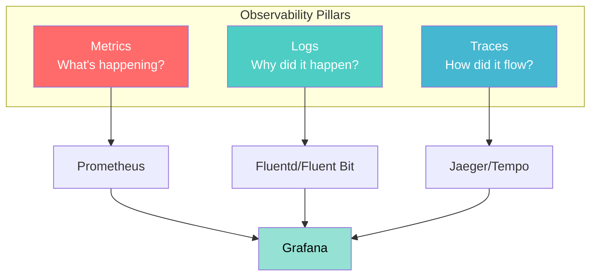

# Observability Basics in Kubernetes

## Overview

**Observability** is the ability to understand the internal state of your system by examining its outputs. In Kubernetes, observability consists of three pillars: **metrics**, **logs**, and **traces**.

---

## The Three Pillars



---

## 1. Metrics (What's Happening?)

Metrics provide numerical measurements over time.

### Metrics Server

**Purpose**: Provides basic CPU and memory metrics for Pods and nodes.

**Installation**:
```bash
kubectl apply -f https://github.com/kubernetes-sigs/metrics-server/releases/latest/download/components.yaml
```

**Usage**:
```bash
# View node metrics
kubectl top nodes

# View pod metrics
kubectl top pods -A

# View pod metrics in a namespace
kubectl top pods -n production
```

### Prometheus

**Purpose**: Industry-standard metrics collection and alerting.

**Key Components**:
- **Prometheus Server**: Scrapes and stores metrics
- **Alertmanager**: Handles alerts
- **Exporters**: Expose metrics from applications
- **Grafana**: Visualize metrics

**Quick Start with Prometheus Operator**:
```bash
# Install Prometheus Operator
kubectl apply -f https://raw.githubusercontent.com/prometheus-operator/prometheus-operator/main/bundle.yaml

# Create ServiceMonitor to scrape your app
kubectl apply -f - <<EOF
apiVersion: monitoring.coreos.com/v1
kind: ServiceMonitor
metadata:
  name: my-app
  labels:
    app: my-app
spec:
  selector:
    matchLabels:
      app: my-app
  endpoints:
  - port: metrics
    interval: 30s
EOF
```

**Common Metrics to Monitor**:
- **CPU usage**: `container_cpu_usage_seconds_total`
- **Memory usage**: `container_memory_working_set_bytes`
- **Request rate**: `http_requests_total`
- **Error rate**: `http_requests_errors_total`
- **Latency**: `http_request_duration_seconds`

---

## 2. Logs (Why Did It Happen?)

Logs provide detailed event information.

### kubectl logs

**Basic log viewing**:
```bash
# View logs for a pod
kubectl logs <pod-name>

# View logs for a specific container
kubectl logs <pod-name> -c <container-name>

# Follow logs (tail -f equivalent)
kubectl logs -f <pod-name>

# View previous container logs (after restart)
kubectl logs <pod-name> --previous

# View last N lines
kubectl logs <pod-name> --tail=100

# View logs from all pods in a deployment
kubectl logs -l app=my-app --all-containers=true
```

### Fluent Bit (Log Forwarder)

**Purpose**: Lightweight log processor and forwarder.

**Example DaemonSet**:
```yaml
apiVersion: apps/v1
kind: DaemonSet
metadata:
  name: fluent-bit
  namespace: logging
spec:
  selector:
    matchLabels:
      app: fluent-bit
  template:
    metadata:
      labels:
        app: fluent-bit
    spec:
      serviceAccountName: fluent-bit
      containers:
      - name: fluent-bit
        image: fluent/fluent-bit:2.2
        volumeMounts:
        - name: varlog
          mountPath: /var/log
        - name: varlibdockercontainers
          mountPath: /var/lib/docker/containers
          readOnly: true
      volumes:
      - name: varlog
        hostPath:
          path: /var/log
      - name: varlibdockercontainers
        hostPath:
          path: /var/lib/docker/containers
```

### Structured Logging

**Best Practice**: Use structured logging (JSON format):

```go
// Application code example (Go)
log.WithFields(log.Fields{
  "user_id": userID,
  "action": "login",
  "status": "success",
}).Info("User logged in")
```

**Output**:
```json
{
  "time": "2026-03-14T10:30:00Z",
  "level": "info",
  "msg": "User logged in",
  "user_id": "12345",
  "action": "login",
  "status": "success"
}
```

---

## 3. Traces (How Did It Flow?)

Traces show the flow of requests through distributed systems.

### OpenTelemetry

**Purpose**: Vendor-neutral observability framework for traces, metrics, and logs.

**OpenTelemetry Operator Installation**:
```bash
# Install cert-manager (required)
kubectl apply -f https://github.com/cert-manager/cert-manager/releases/download/v1.14.0/cert-manager.yaml

# Install OpenTelemetry Operator
kubectl apply -f https://github.com/open-telemetry/opentelemetry-operator/releases/latest/download/opentelemetry-operator.yaml
```

**Example: Auto-Instrumentation**:
```yaml
apiVersion: opentelemetry.io/v1alpha1
kind: Instrumentation
metadata:
  name: my-instrumentation
spec:
  exporter:
    endpoint: http://jaeger-collector:4318
  propagators:
    - tracecontext
    - baggage
  sampler:
    type: parentbased_traceidratio
    argument: "0.1"  # Sample 10% of traces
```

**Annotate Deployment for Auto-Instrumentation**:
```yaml
apiVersion: apps/v1
kind: Deployment
metadata:
  name: my-app
spec:
  template:
    metadata:
      annotations:
        instrumentation.opentelemetry.io/inject-java: "true"
    spec:
      containers:
      - name: app
        image: my-java-app:1.0
```

### Jaeger (Tracing Backend)

**Quick Start**:
```bash
# Install Jaeger Operator
kubectl create namespace observability
kubectl apply -f https://github.com/jaegertracing/jaeger-operator/releases/latest/download/jaeger-operator.yaml -n observability

# Deploy Jaeger instance
kubectl apply -f - <<EOF
apiVersion: jaegertracing.io/v1
kind: Jaeger
metadata:
  name: simplest
  namespace: observability
EOF

# Access Jaeger UI
kubectl port-forward -n observability svc/simplest-query 16686:16686
# Open http://localhost:16686
```

---

## Complete Observability Stack Example

```yaml
# Namespace for observability components
---
apiVersion: v1
kind: Namespace
metadata:
  name: observability

# Prometheus for metrics
---
apiVersion: v1
kind: ConfigMap
metadata:
  name: prometheus-config
  namespace: observability
data:
  prometheus.yml: |
    global:
      scrape_interval: 15s
    scrape_configs:
    - job_name: 'kubernetes-pods'
      kubernetes_sd_configs:
      - role: pod
      relabel_configs:
      - source_labels: [__meta_kubernetes_pod_annotation_prometheus_io_scrape]
        action: keep
        regex: true
      - source_labels: [__meta_kubernetes_pod_annotation_prometheus_io_path]
        action: replace
        target_label: __metrics_path__
        regex: (.+)
      - source_labels: [__address__, __meta_kubernetes_pod_annotation_prometheus_io_port]
        action: replace
        regex: ([^:]+)(?::\d+)?;(\d+)
        replacement: $1:$2
        target_label: __address__

---
apiVersion: apps/v1
kind: Deployment
metadata:
  name: prometheus
  namespace: observability
spec:
  replicas: 1
  selector:
    matchLabels:
      app: prometheus
  template:
    metadata:
      labels:
        app: prometheus
    spec:
      containers:
      - name: prometheus
        image: prom/prometheus:v2.51.0
        args:
        - '--config.file=/etc/prometheus/prometheus.yml'
        - '--storage.tsdb.path=/prometheus'
        ports:
        - containerPort: 9090
        volumeMounts:
        - name: config
          mountPath: /etc/prometheus
        - name: storage
          mountPath: /prometheus
      volumes:
      - name: config
        configMap:
          name: prometheus-config
      - name: storage
        emptyDir: {}

---
apiVersion: v1
kind: Service
metadata:
  name: prometheus
  namespace: observability
spec:
  selector:
    app: prometheus
  ports:
  - port: 9090
    targetPort: 9090

# Grafana for visualization
---
apiVersion: apps/v1
kind: Deployment
metadata:
  name: grafana
  namespace: observability
spec:
  replicas: 1
  selector:
    matchLabels:
      app: grafana
  template:
    metadata:
      labels:
        app: grafana
    spec:
      containers:
      - name: grafana
        image: grafana/grafana:10.4.0
        ports:
        - containerPort: 3000
        env:
        - name: GF_SECURITY_ADMIN_PASSWORD
          value: admin
        volumeMounts:
        - name: storage
          mountPath: /var/lib/grafana
      volumes:
      - name: storage
        emptyDir: {}

---
apiVersion: v1
kind: Service
metadata:
  name: grafana
  namespace: observability
spec:
  selector:
    app: grafana
  ports:
  - port: 3000
    targetPort: 3000
  type: LoadBalancer
```

**Access the stack**:
```bash
# Apply the stack
kubectl apply -f observability-stack.yaml

# Port-forward Prometheus
kubectl port-forward -n observability svc/prometheus 9090:9090

# Port-forward Grafana
kubectl port-forward -n observability svc/grafana 3000:3000
# Login: admin/admin
```

---

## Application Instrumentation Example

```yaml
apiVersion: apps/v1
kind: Deployment
metadata:
  name: instrumented-app
spec:
  replicas: 2
  selector:
    matchLabels:
      app: instrumented-app
  template:
    metadata:
      labels:
        app: instrumented-app
      annotations:
        # Prometheus scraping annotations
        prometheus.io/scrape: "true"
        prometheus.io/port: "8080"
        prometheus.io/path: "/metrics"
    spec:
      containers:
      - name: app
        image: myapp:1.0
        ports:
        - containerPort: 8080
          name: http
        - containerPort: 9090
          name: metrics
        env:
        # OpenTelemetry configuration
        - name: OTEL_EXPORTER_OTLP_ENDPOINT
          value: "http://otel-collector:4318"
        - name: OTEL_SERVICE_NAME
          value: "instrumented-app"
        - name: OTEL_TRACES_SAMPLER
          value: "parentbased_traceidratio"
        - name: OTEL_TRACES_SAMPLER_ARG
          value: "0.1"
        resources:
          requests:
            memory: "128Mi"
            cpu: "100m"
          limits:
            memory: "256Mi"
            cpu: "200m"
```

---

## Best Practices

### 1. Metrics

✅ **Use labels wisely** - Keep cardinality under control
✅ **Set up alerts** - Don't just collect, act on metrics
✅ **Monitor the 4 golden signals**: Latency, Traffic, Errors, Saturation
✅ **Use ServiceMonitors** - Automate Prometheus target discovery

### 2. Logs

✅ **Use structured logging** - JSON format for easy parsing
✅ **Include context** - trace_id, user_id, request_id
✅ **Set appropriate log levels** - INFO for production
✅ **Centralize logs** - Don't rely on kubectl logs
✅ **Implement log rotation** - Prevent disk space issues

### 3. Traces

✅ **Sample appropriately** - 100% sampling is expensive
✅ **Propagate context** - Use W3C Trace Context
✅ **Trace critical paths** - Not everything needs tracing
✅ **Set span attributes** - Add useful metadata

### 4. General

✅ **Start simple** - Metrics server → Prometheus → Full stack
✅ **Monitor what matters** - Focus on user-facing metrics
✅ **Set SLOs** - Define service level objectives
✅ **Test your observability** - Ensure it works during incidents
✅ **Use dashboards** - Visualize for quick insights

---

## Troubleshooting with Observability

### Scenario 1: High Latency

```bash
# 1. Check metrics - identify slow pods
kubectl top pods -n production

# 2. Check traces - find slow operations
# View in Jaeger UI: http://localhost:16686

# 3. Check logs - look for errors
kubectl logs -n production -l app=my-app --tail=100 | grep ERROR
```

### Scenario 2: High Error Rate

```bash
# 1. Check metrics - error rate spike
# Query Prometheus: rate(http_requests_errors_total[5m])

# 2. Check logs - what errors?
kubectl logs -n production -l app=my-app --tail=1000 | grep -i error

# 3. Check traces - which endpoints?
# Filter in Jaeger: service=my-app status=error
```

---

## Additional Resources

- [Prometheus Documentation](https://prometheus.io/docs/)
- [OpenTelemetry Documentation](https://opentelemetry.io/docs/)
- [Grafana Documentation](https://grafana.com/docs/)
- [Fluent Bit Documentation](https://docs.fluentbit.io/)
- [Jaeger Documentation](https://www.jaegertracing.io/docs/)

---

## Summary

✅ **Three Pillars**: Metrics (what), Logs (why), Traces (how)
✅ **Start Simple**: Metrics Server → Prometheus → Full Stack
✅ **Instrument Applications**: Add metrics, logs, and traces
✅ **Centralize**: Collect all telemetry in one place
✅ **Visualize**: Use Grafana for dashboards
✅ **Alert**: Set up meaningful alerts
✅ **Practice**: Test observability during incidents

Observability is essential for running production Kubernetes clusters. Start with basics and expand as needed!
