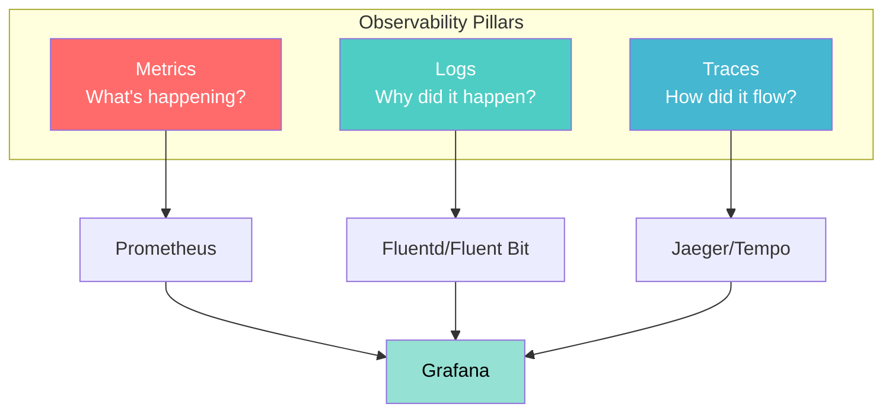

# Observability basics in Kubernetes

## Overview

**Observability** is the ability to infer internal system state from external outputs. In Kubernetes, observability is often described with three pillars: **metrics**, **logs**, and **traces**.

---

## The three pillars



Near-real-time **CPU and memory** for scheduling and autoscaling are exposed separately through the **Metrics API** and **Metrics Server** (covered below). Broader dashboards, alerting, and history usually build on **Prometheus**, **Grafana**, log pipelines, and trace backends.

---

## Metrics Server

**Metrics Server** is an in-cluster component that **aggregates resource usage** (CPU and memory) from kubelets and exposes it through the **Metrics API**. That API backs **`kubectl top`** and supports **Horizontal Pod Autoscaler (HPA)** when scaling on CPU or memory.

### Use cases

- **Real-time utilization**: View current CPU/memory for nodes and Pods (`kubectl top` style workflows).
- **Autoscaling**: Supply resource metrics to HPA so replica counts can track demand.
- **Troubleshooting**: Spot hot nodes or mis-sized containers when requests/limits and actual usage diverge.
- **Capacity planning**: Reason about headroom and sizing using recent utilization (Metrics Server retains only short-term data; long-term planning usually needs Prometheus or cloud monitoring).

### Architecture and Metrics API flow

1. **Kubelet** exposes container and node metrics via **`/stats/summary`** and related endpoints.
2. **Metrics Server** scrapes those summaries, normalizes them, and serves the **Metrics API** (`metrics.k8s.io`), which is aggregated into the API server like other extension APIs.
3. **Consumers**—the HPA controller, **`kubectl top`**, and UIs that call the Metrics API—read node and Pod **resource** metrics through that path.

On many clusters, Metrics Server runs as a **Deployment** in `kube-system` (or similar), with a **Service**, **APIService** registration for `metrics.k8s.io`, and **RBAC** so it can reach kubelets and expose metrics securely.

**TLS** between Metrics Server and kubelets must be trusted. Lab clusters sometimes need extra flags or configuration depending on how the kubelet presents its serving certificate.

Metrics Server answers **“what is usage right now?”** for scheduling and autoscaling. It is **not** a full monitoring platform: limited retention, no rich query language, and no long-term alerting by itself. Installation, verification, and common lab-cluster fixes belong in guided labs rather than here.

### Relationship to other observability tools

| **Tool** | **Role** | **Compared to Metrics Server** |
|----------|----------|--------------------------------|
| **Prometheus** | Scrapes metrics, rules, alerting | Historical TSDB and PromQL; often paired with Grafana |
| **Grafana Agent / Alloy** | Collect and forward metrics | Heavier or lighter paths to a backend |
| **OpenTelemetry** | Metrics, traces, logs | Vendor-neutral instrumentation and pipelines |
| **cAdvisor** | Container metrics | Often scraped by Prometheus |
| **Cloud vendor monitoring** | Managed metrics for AKS/EKS/GKE | Integrated dashboards and alarms |

Commercial platforms (Datadog, Sysdig, and others) also ingest Kubernetes metrics and add APM, security, or fleet features.

---

## Prometheus, Grafana, and richer monitoring

Beyond resource metrics, teams typically want numeric time series (rates, histograms, gauges) for dashboards, alerting, and custom autoscaling signals.

### Prometheus (typical pattern)

**Purpose**: Pull-based collection, rule evaluation, and alerting; often the **metrics backbone** for Kubernetes.

**Common pieces**
- **Prometheus server**: scrape targets, store samples
- **Alertmanager**: route and dedupe alerts
- **Exporters / kube-state-metrics**: expose cluster and app metrics
- **Grafana**: visualize Prometheus (and other) data sources

**ServiceMonitor example** (Prometheus Operator style): declares how an app’s metrics port should be discovered.

```yaml
apiVersion: monitoring.coreos.com/v1
kind: ServiceMonitor
metadata:
  name: my-app
  labels:
    app: my-app
spec:
  selector:
    matchLabels:
      app: my-app
  endpoints:
  - port: metrics
    interval: 30s
```

**Examples of useful series** (names vary by exporter)
- Container CPU: `container_cpu_usage_seconds_total`
- Container memory working set: `container_memory_working_set_bytes`
- HTTP: `http_requests_total`, error and latency histograms

---

## Example: composing metrics + visualization

The following YAML sketches **separate** Deployments for Prometheus and Grafana in an `observability` namespace. It illustrates **how** components might be wired (ConfigMap-mounted Prometheus config, Services on 9090/3000); applying it to a live cluster, persistence, and secrets are operational concerns covered in labs or runbooks.

```yaml
apiVersion: v1
kind: Namespace
metadata:
  name: observability
---
apiVersion: v1
kind: ConfigMap
metadata:
  name: prometheus-config
  namespace: observability
data:
  prometheus.yml: |
    global:
      scrape_interval: 15s
    scrape_configs:
    - job_name: 'kubernetes-pods'
      kubernetes_sd_configs:
      - role: pod
---
apiVersion: apps/v1
kind: Deployment
metadata:
  name: prometheus
  namespace: observability
spec:
  replicas: 1
  selector:
    matchLabels:
      app: prometheus
  template:
    metadata:
      labels:
        app: prometheus
    spec:
      containers:
      - name: prometheus
        image: prom/prometheus:v2.51.0
        args:
        - '--config.file=/etc/prometheus/prometheus.yml'
        ports:
        - containerPort: 9090
        volumeMounts:
        - name: config
          mountPath: /etc/prometheus
      volumes:
      - name: config
        configMap:
          name: prometheus-config
---
apiVersion: v1
kind: Service
metadata:
  name: prometheus
  namespace: observability
spec:
  selector:
    app: prometheus
  ports:
  - port: 9090
    targetPort: 9090
---
apiVersion: apps/v1
kind: Deployment
metadata:
  name: grafana
  namespace: observability
spec:
  replicas: 1
  selector:
    matchLabels:
      app: grafana
  template:
    metadata:
      labels:
        app: grafana
    spec:
      containers:
      - name: grafana
        image: grafana/grafana:10.4.0
        ports:
        - containerPort: 3000
---
apiVersion: v1
kind: Service
metadata:
  name: grafana
  namespace: observability
spec:
  selector:
    app: grafana
  ports:
  - port: 3000
    targetPort: 3000
```

---

## Logging (why did it happen?)

Logs are discrete events with timestamps and (ideally) structured fields.

### kubectl logs

`kubectl logs` streams **stdout/stderr** from a container. It is ideal for **quick triage** but not a durable log archive. Production setups **centralize** logs with an agent (DaemonSet or sidecar) shipping to object storage, Elasticsearch, Loki, or a vendor backend.

### Fluent Bit (illustrative DaemonSet pattern)

Agents often run on **every node**, mount host log paths read-only, parse and forward lines:

```yaml
apiVersion: apps/v1
kind: DaemonSet
metadata:
  name: fluent-bit
  namespace: logging
spec:
  selector:
    matchLabels:
      app: fluent-bit
  template:
    metadata:
      labels:
        app: fluent-bit
    spec:
      serviceAccountName: fluent-bit
      containers:
      - name: fluent-bit
        image: fluent/fluent-bit:2.2
        volumeMounts:
        - name: varlog
          mountPath: /var/log
        - name: varlibdockercontainers
          mountPath: /var/lib/docker/containers
          readOnly: true
      volumes:
      - name: varlog
        hostPath:
          path: /var/log
      - name: varlibdockercontainers
        hostPath:
          path: /var/lib/docker/containers
```

### Structured logging

Structured logs (often **JSON**) let you filter by `level`, `trace_id`, `user_id`, and so on without fragile regex.

---

## Tracing (how did the request flow?)

Traces connect spans across services for latency and dependency analysis.

### OpenTelemetry

**Purpose**: Vendor-neutral instrumentation and export for metrics, traces, and logs.

**Instrumentation resource** (illustrative): configures exporters, propagators, and sampling.

```yaml
apiVersion: opentelemetry.io/v1alpha1
kind: Instrumentation
metadata:
  name: my-instrumentation
spec:
  exporter:
    endpoint: http://jaeger-collector:4318
  propagators:
    - tracecontext
    - baggage
  sampler:
    type: parentbased_traceidratio
    argument: "0.1"
```

**Pod template annotation** (concept): operators can inject instrumentation based on annotations on the workload.

```yaml
apiVersion: apps/v1
kind: Deployment
metadata:
  name: my-app
spec:
  template:
    metadata:
      annotations:
        instrumentation.opentelemetry.io/inject-java: "true"
    spec:
      containers:
      - name: app
        image: my-java-app:1.0
```

### Jaeger / Tempo

Backends store trace spans and provide a UI. Deployment choices (operator vs Helm vs cloud) vary; the important idea is **correlating** traces with logs and metrics via shared identifiers.

---

## Application instrumentation example

Annotations and ports expose metrics to scrapers; environment variables can point OpenTelemetry exporters at collectors.

```yaml
apiVersion: apps/v1
kind: Deployment
metadata:
  name: instrumented-app
spec:
  replicas: 2
  selector:
    matchLabels:
      app: instrumented-app
  template:
    metadata:
      labels:
        app: instrumented-app
      annotations:
        prometheus.io/scrape: "true"
        prometheus.io/port: "8080"
        prometheus.io/path: "/metrics"
    spec:
      containers:
      - name: app
        image: myapp:1.0
        ports:
        - containerPort: 8080
          name: http
        - containerPort: 9090
          name: metrics
        env:
        - name: OTEL_EXPORTER_OTLP_ENDPOINT
          value: "http://otel-collector:4318"
        - name: OTEL_SERVICE_NAME
          value: "instrumented-app"
        resources:
          requests:
            memory: "128Mi"
            cpu: "100m"
          limits:
            memory: "256Mi"
            cpu: "200m"
```

---

## Best practices (concise)

### Metrics

- Control **label cardinality**; exploding labels break TSDBs.
- Alert on **user-visible** symptoms and **golden signals** (latency, traffic, errors, saturation).
- Prefer **ServiceMonitor** or equivalent discovery over hand-edited scrape lists.

### Logs

- Prefer **structured** logs and stable field names.
- Include **request/trace** correlation IDs when traces are in use.
- **Centralize** and set retention; do not rely only on node-local files.

### Traces

- Use **sampling**; full capture is expensive at scale.
- Propagate **W3C Trace Context** (or your mesh’s equivalent) across services.

### General

- Grow complexity gradually: **Metrics Server → Prometheus/Grafana → full stack**.
- **Test** dashboards and alerts during calm periods, not only during incidents.

---

## Troubleshooting with observability (conceptual)

- **High latency**: Use metrics to find hot Pods or nodes; traces to find slow spans; logs around the same time window for errors.
- **Error spikes**: Metrics for error rate; logs for stack traces; traces to see which routes fail.

---

## Hands-On Labs

Practice these concepts with guided lab exercises:

| Lab | Description |
|-----|-------------|
| [Lab 36: Metrics Server](../../labmanuals/lab36-observe-metrics-server.md) | Deploy or verify Metrics Server, use `kubectl top`, explore the Metrics API, and relate metrics to HPA behavior. |
| [Lab 30: Horizontal Pod Autoscaling](../../labmanuals/lab30-workload-hpa.md) | Use resource metrics from the Metrics API with HPA for CPU- and memory-driven scaling. |

---

## Additional resources

- [Prometheus Documentation](https://prometheus.io/docs/)
- [OpenTelemetry Documentation](https://opentelemetry.io/docs/)
- [Grafana Documentation](https://grafana.com/docs/)
- [Fluent Bit Documentation](https://docs.fluentbit.io/)
- [Jaeger Documentation](https://www.jaegertracing.io/docs/)

---

## Summary

- **Three pillars**: metrics (what), logs (why), traces (how).
- **Metrics Server** is the default path for near-real-time **resource** metrics and **`kubectl top`**; **Prometheus/Grafana** cover richer monitoring, history, and alerting.
- **Centralize logs** and **instrument apps** deliberately.
- Expand the stack as requirements grow; validate tooling in exercises and staging before production reliance.

Observability is essential for operating Kubernetes clusters; start with clear signals and add depth when teams can own the extra moving parts.
